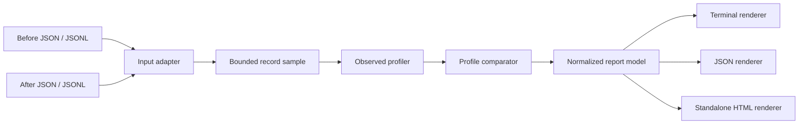

# SchemaStory Architecture

## Goals

- Deterministic, local and auditable.
- Zero production dependencies for the first release.
- Useful from `npx` without a build step at runtime.
- Streaming JSONL and bounded resource usage.
- Stable core API separated from CLI and presentation.
- Reports that do not contain raw input values.

## Technology choice

SchemaStory uses modern JavaScript ESM on Node.js 22+. JavaScript avoids shipping a compile-time runtime dependency, while JSDoc and focused module boundaries keep the public API understandable. Tests use `node:test`. ESLint and Prettier are development-only tools.

## Data flow



## Module layout

```text
bin/
  schemastory.js       CLI executable
src/
  cli.js               argument parsing and process orchestration
  compare.js           rule-based profile comparison
  errors.js            user-facing error types
  html.js              standalone report renderer
  index.js             public library exports
  input.js             JSON/JSONL bounded readers
  paths.js             stable observed JSON path utilities
  profile.js           structure profiling
  terminal.js          terminal renderer
  version.js           release version constant
test/
  *.test.js            unit and CLI integration tests
examples/
  v1.jsonl
  v2.jsonl
  report.html          generated demo artifact
```

## Observed profile model

Each path stores aggregates only:

```json
{
  "path": "$.message.content",
  "observations": 12,
  "presentRecords": 10,
  "recordCoverage": 1,
  "nullCount": 0,
  "nullRatio": 0,
  "types": {
    "string": 12
  }
}
```

Definitions:

- **observation:** one value encountered at a normalized path;
- **present record:** a top-level record containing at least one observation at the path;
- **record coverage:** present records divided by sampled top-level records;
- **null ratio:** null observations divided by all observations at the path;
- array items use `[]`, so all elements share one path family.

No example value, hash of a value or high-cardinality value summary belongs in the P0 profile.

## Path notation

- Root: `$`
- Identifier property: `$.message`
- Property requiring quoting: `$["build.id"]`
- Array item: `$.messages[]`
- Nested array object property: `$.messages[].content`

The notation is deterministic and meant for reports, not evaluation against input.

## Resource limits

Defaults:

- maximum sampled records: 10,000;
- maximum traversal depth: 20;
- maximum observed paths: 5,000;
- maximum non-streamed JSON input size: 50 MiB.

Limits are reported, not hidden. JSONL is read line by line. JSON arrays use `JSON.parse` in v0.1 and are protected by the byte limit; a streaming array parser can be a later adapter.

## Comparison pipeline

1. Build path maps for before and after profiles.
2. Classify additions, removals and type-set changes.
3. Evaluate coverage and null-ratio thresholds for surviving paths.
4. Suppress descendant additions/removals when an ancestor already communicates the same subtree change.
5. Sort by severity, path and change kind for stable output.
6. Compute summary counts without a synthetic risk score.

All rules are pure functions and independently tested.

## Privacy and security

- Values are inspected only to determine their JSON type and traversal structure.
- Renderers receive the aggregate report model, never source records.
- Parse errors mention source and line/position, not record contents.
- HTML escapes every user-derived string and loads no external asset.
- `--open` opens only the report path created by the current command.
- No telemetry, update checks or network requests exist in runtime code.
- Input limits prevent accidental unbounded memory/path growth.

## CLI behavior

The CLI layer owns argument validation, output writes, optional browser launch and exit codes. Core modules do not call `process.exit`, write files or color output. This allows library use and deterministic tests.

## Error model

`SchemaStoryError` contains a stable `code`, a plain-language message and an actionable hint. Expected user errors exit with code 2 and no stack trace. Unexpected errors include a short failure message; development tests still surface stacks.

Examples:

- `INPUT_NOT_FOUND`: identify the path and ask the user to verify it.
- `JSONL_PARSE_ERROR`: identify line number and ask for one valid JSON value per line.
- `INVALID_THRESHOLD`: show the accepted 0..1 range.
- `LIMIT_EXCEEDED`: explain which CLI option can intentionally raise the bound.

## Testing strategy

- Unit tests for type detection, path normalization and profiling.
- Rule table tests for every severity transition.
- Privacy regression tests with recognizable secret-like values.
- Input tests for JSON, JSONL, malformed lines and truncation.
- Snapshot-like assertions for deterministic terminal/JSON output.
- CLI subprocess tests for exit codes and generated HTML.
- CI matrix for Node 22 and 24 on Ubuntu, Windows and macOS.

## Architecture decisions

### ADR-001: Samples are observations, not schemas

Reports use “observed” language and retain sampling metadata. SchemaStory will not export an authoritative contract in v0.1.

### ADR-002: No raw values in reports

This is a structural guarantee and positioning choice, not a configurable default that can silently change.

### ADR-003: Zero production dependencies

JSON/JSONL parsing, traversal and rendering are small enough to audit and maintain using Node APIs. Development tooling may use pinned dependencies.

### ADR-004: No mystery score

Individual changes retain transparent rules. A total “health score” would hide assumptions and imply unjustified precision.

### ADR-005: Exploratory commands pass by default

The CLI defaults to `--fail-on never`; CI failure is explicit through `--fail-on breaking|warning`.
