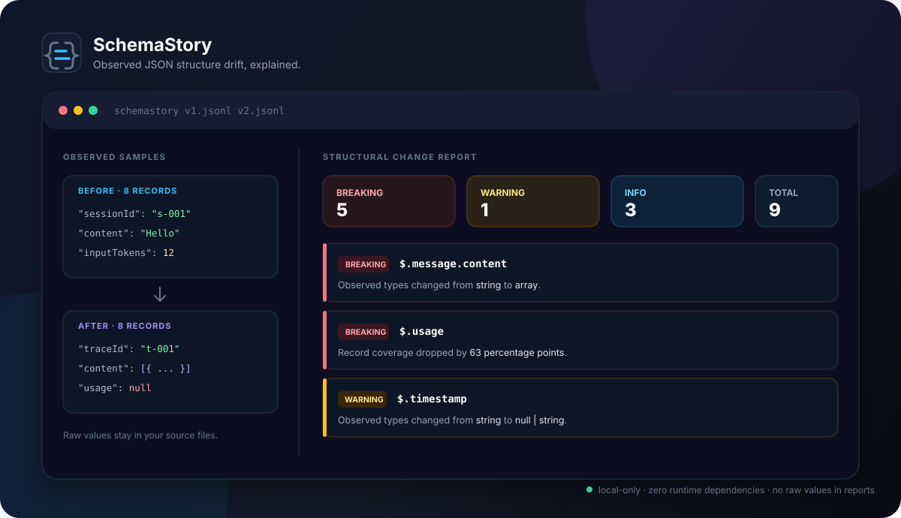

# SchemaStory

> See how your real JSON shape changed — even when you never had a schema.

[](https://github.com/Teddy28-dron/schemastory/actions/workflows/ci.yml)
[](https://nodejs.org/)
[](LICENSE)
[](package.json)



SchemaStory is a local-first CLI that compares two JSON, JSONL, or NDJSON samples. It infers their _observed_ structure, identifies breaking and suspicious changes, and creates a terminal, JSON, or standalone HTML report without copying raw values into that report.

English · [简体中文](README.zh-CN.md)

## Why SchemaStory?

APIs, event streams, LLM traces, exports, and data pipelines often change before anyone writes a formal schema. A field disappears, a string becomes an array, or a previously reliable object starts arriving in only 30% of records. The first clue is usually a broken consumer.

SchemaStory makes that drift visible from the samples you already have:

- **Works without a schema:** compare real `.json`, `.jsonl`, or `.ndjson` files directly.
- **Explains impact:** classifies removals, incompatible types, coverage drops, null increases, and additions.
- **Safe to share:** reports contain paths, types, and aggregate ratios — never raw input values.
- **Made for humans and CI:** readable terminal output, stable JSON, a self-contained HTML report, and policy exit codes.
- **Small and auditable:** zero runtime dependencies, no network requests, no account, and no telemetry.

## Try it in 30 seconds

Requires Node.js 22 or newer. Until the npm package is published, run the current source directly from GitHub:

```bash
npx --yes github:Teddy28-dron/schemastory before.jsonl after.jsonl
```

Create and open a visual report:

```bash
npx --yes github:Teddy28-dron/schemastory before.jsonl after.jsonl --format html --output report.html --open
```

Try the repository demo:

```bash
git clone https://github.com/Teddy28-dron/schemastory.git
cd schemastory
npm install
npm run demo
```

Then open `examples/report.html`. The checked-in [demo inputs](examples/) represent an agent trace format changing between two releases.

## What it catches

Given a v1 record:

```json
{ "sessionId": "s-001", "message": { "content": "Hello" }, "usage": { "inputTokens": 12 } }
```

and a v2 record:

```json
{ "traceId": "t-001", "message": { "content": [{ "type": "text" }] }, "usage": null }
```

SchemaStory highlights:

```text
BREAKING $.message.content
         Observed types changed from string to array.

BREAKING $.sessionId
         This previously observed path is absent from the after sample.

INFO     $.traceId
         This path was observed in the after sample only.
```

It also measures **record coverage** (how many top-level records contain a path) and **null ratio**. That exposes gradual drift that a single example or hand-written schema diff can miss.

## Common workflows

### Explore a change locally

```bash
schemastory export-before.json export-after.json
```

Exploratory commands return exit code `0` by default, even when changes are found.

### Save machine-readable JSON

```bash
schemastory before.jsonl after.jsonl --format json --output drift.json
```

The JSON report has a versioned top-level shape (`schemaVersion: 1`) and stable change ordering.

### Protect CI from breaking drift

```bash
schemastory fixture-v1.jsonl fixture-v2.jsonl --format json --fail-on breaking
```

Use `--fail-on warning` to fail on both warnings and breaking changes, or `--fail-on never` for reporting only.

### Tune sample bounds and sensitivity

```bash
schemastory before.jsonl after.jsonl \
  --max-records 50000 \
  --max-depth 30 \
  --coverage-threshold 0.10 \
  --null-threshold 0.15
```

Thresholds are absolute percentage-point differences expressed from `0` to `1`.

## CLI reference

```text
schemastory [options] <before.json|jsonl> <after.json|jsonl>

-f, --format <terminal|json|html>  Output format (default: terminal)
-o, --output <path>               Write output to a file
    --max-records <number>        Records sampled per input (default: 10000)
    --max-depth <number>          Nested traversal depth (default: 20)
    --coverage-threshold <0..1>   Coverage-drop threshold (default: 0.20)
    --null-threshold <0..1>       Null-increase threshold (default: 0.20)
    --fail-on <breaking|warning|never>
                                   CI failure policy (default: never)
    --open                        Open the generated HTML report
    --no-color                    Disable ANSI terminal colors
-h, --help                        Show help
-v, --version                     Show version
```

Exit codes:

| Code | Meaning                                                      |
| ---: | ------------------------------------------------------------ |
|  `0` | Analysis completed and the configured policy passed.         |
|  `1` | Analysis completed and `--fail-on` matched detected changes. |
|  `2` | Arguments, input, or output were invalid.                    |

If `--output` ends in `.json` or `.html`, SchemaStory infers the format. HTML without an explicit path is written to `schemastory-report.html`.

## Change rules

| Observation                                       | Default severity |
| ------------------------------------------------- | ---------------- |
| Previously observed path is absent                | Breaking         |
| Type disappears and is not safely widened         | Breaking         |
| Near-universal path becomes sparse                | Breaking         |
| New observed type, including nullable             | Warning          |
| Coverage drops by at least 20 percentage points   | Warning          |
| Null ratio rises by at least 20 percentage points | Warning          |
| New observed path                                 | Info             |
| Integer widens to number                          | Info             |

Rules are deterministic and visible in [`src/compare.js`](src/compare.js). Descendant additions and removals are collapsed when their parent already explains the whole subtree.

## How it works

```text
before + after → bounded sample → observed path profiles → transparent rules → report
```

1. The input adapter parses JSON or streams JSONL/NDJSON within explicit limits.
2. The profiler walks each sampled record and retains only paths, types, counts, coverage, and null ratios.
3. The comparator applies deterministic rules and collapses repetitive subtree changes.
4. A renderer turns the same normalized report into terminal, JSON, or standalone HTML output.

The core is separated from file output and process exits, so the same behavior is available through the JavaScript API.

## Compared with existing tools

| Tool category              | Best when                                                        | Where SchemaStory differs                                                                    |
| -------------------------- | ---------------------------------------------------------------- | -------------------------------------------------------------------------------------------- |
| JSON Schema / OpenAPI diff | Both versions already have trustworthy formal contracts          | SchemaStory starts from real samples when a contract is missing or stale.                    |
| Deep JSON diff             | You need every value-level edit between two documents            | SchemaStory groups observations across records and intentionally excludes values.            |
| Data profiling suites      | You need distributions, quality checks, notebooks, or monitoring | SchemaStory stays narrow: one local structural comparison with zero runtime dependencies.    |
| Hand-written scripts       | The shape and rule are one-off and already understood            | SchemaStory supplies consistent paths, severity rules, reports, limits, tests, and CI exits. |

If a formal schema is authoritative, use a schema-aware compatibility tool. SchemaStory is for the earlier, messier moment when the payloads are the evidence.

## Privacy model

SchemaStory reads values locally to determine JSON types and nesting, then discards them. Reports receive aggregate profiles only:

```json
{
  "path": "$.message.content",
  "observations": 8,
  "presentRecords": 8,
  "recordCoverage": 1,
  "nullCount": 0,
  "nullRatio": 0,
  "types": { "string": 8 }
}
```

There are no runtime network calls, telemetry hooks, value previews, value hashes, or external assets in HTML reports. File basenames can appear in reports; choose neutral filenames if even names are sensitive.

## Input limits

SchemaStory is deliberately bounded:

- JSONL/NDJSON is read line by line and stops after 10,000 records by default.
- JSON files are limited to 50 MiB and arrays are parsed in memory in v0.1.
- Traversal stops after depth 20 and 5,000 observed paths.
- Truncation is disclosed in the report instead of being hidden.

Raise record/depth limits intentionally with CLI options. The field and JSON-byte limits are currently library constants.

## JavaScript API

```js
import { analyzeFiles, analyzeToHtml } from 'schemastory';

const report = await analyzeFiles('before.jsonl', 'after.jsonl', {
  maxRecords: 25_000,
  coverageDrop: 0.1,
});

const html = await analyzeToHtml('before.jsonl', 'after.jsonl');
```

The exported profiling and rendering functions are listed in [`src/index.js`](src/index.js).

## What SchemaStory is not

- It compares observed samples; it does not prove a complete data contract.
- It does not replace JSON Schema, OpenAPI, or runtime validation.
- It does not detect statistical distribution or semantic value drift.
- It does not infer renames. A rename appears as one removal and one addition.
- A sample can miss rare fields, so representative inputs still matter.

These boundaries are intentional. See the [architecture decisions](ARCHITECTURE.md) and [product requirements](PRD.md).

## Project status and roadmap

Version `0.1.0` implements the complete first-use loop: JSON/JSONL/NDJSON input, observed profiles, drift classification, three report formats, policy exits, examples, and privacy regression tests. The source and first release are [published on GitHub](https://github.com/Teddy28-dron/schemastory); npm publication is still pending.

Next releases are intentionally feedback-led: configuration and ignored paths, Markdown output, reusable privacy-safe profiles, then an official GitHub Action. See the full [Roadmap](ROADMAP.md) and [Changelog](CHANGELOG.md).

## Development

```bash
npm install
npm test
npm run lint
npm run format:check
npm run test:coverage
```

The project targets Node.js 22 and 24 on Linux, macOS, and Windows. For design context, see [Architecture](ARCHITECTURE.md), [Roadmap](ROADMAP.md), and [Competitor analysis](COMPETITOR_ANALYSIS.md).

## Contributing

Bug reports, fixtures, rule discussions, and documentation improvements are welcome. Start with [CONTRIBUTING.md](CONTRIBUTING.md), follow the [Code of Conduct](CODE_OF_CONDUCT.md), and report vulnerabilities through [SECURITY.md](SECURITY.md).

If SchemaStory prevents one confusing data break for you, consider starring the repository and sharing the report screenshot — that is the clearest signal for what to build next.

## License

[MIT](LICENSE) © SchemaStory contributors.
